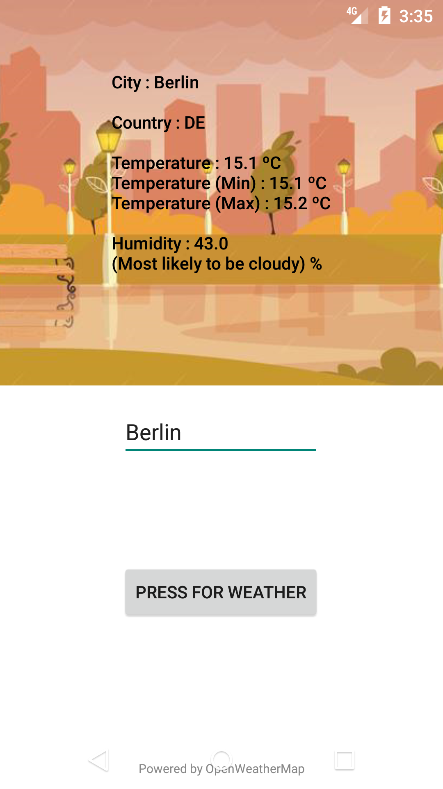

# McWeather
A simple weather app using OpenWeatherMap's API

I did this app to play around with API's and Retrofit, and i believe it is a neat little app!

It allows you to check on the weather in your country, mainly the temperature (as registered by the API), 
the humidity level (also as registered by the API) and a nice little vector to show you an utopian version of what the weather should be, in your city, among other things :)

# Future updates

- [X] Adding weather estimatives based on collected data
- [ ] Making the application work on Wear and legacy devices
- [ ] Better UI/UX
